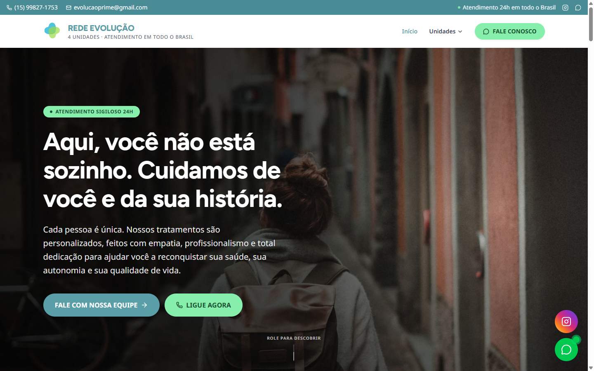
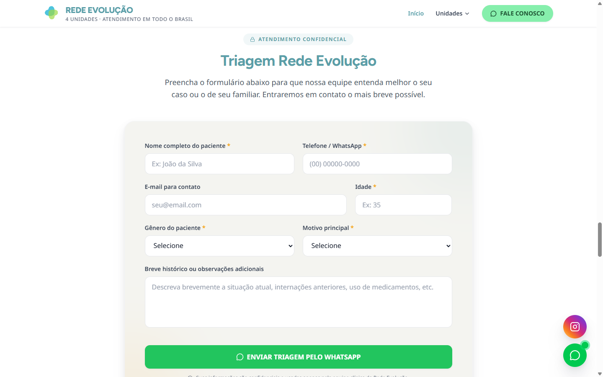
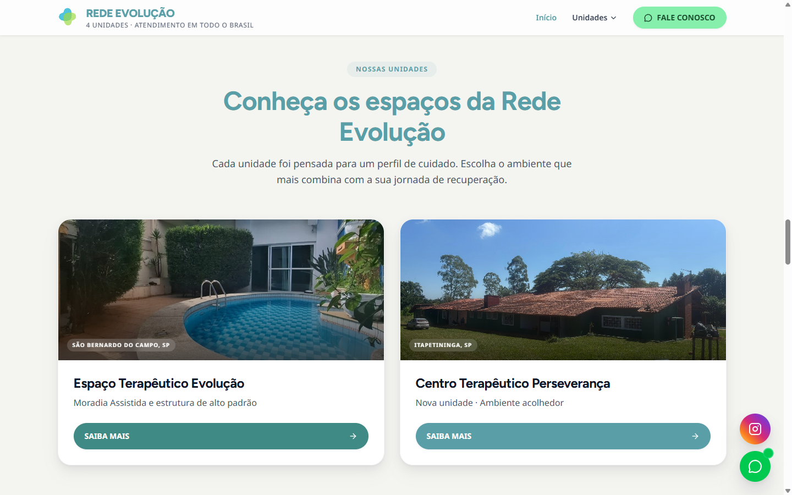
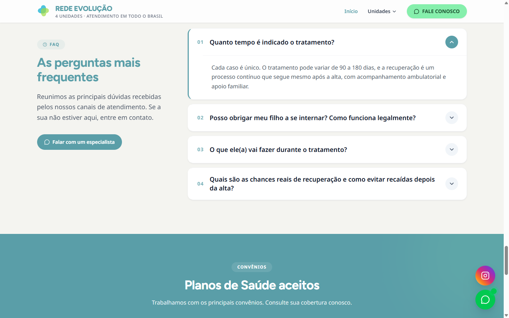

<div align="center">

# Rede Evolução

**Site institucional de conversão para uma rede de clínicas de reabilitação.**<br>
Uma base de código, cinco marcas: a rede e suas 4 unidades. Cliente real, no ar.

[](https://www.clinicaredeevolucao.com.br)

<sub>


</sub>



</div>

---

## O contexto

Clínica de reabilitação (dependência química, alcoolismo e saúde mental) com 4 unidades
em São Paulo e atendimento nacional. Quem chega no site quase nunca é o paciente: é a
mãe, a esposa, o irmão. Está em crise, no celular, e precisa falar com alguém **agora**.

Isso definiu o projeto inteiro. Não é um site pra ser bonito e ser lido, é um site pra
tirar a pessoa da dúvida e colocar ela numa conversa. Todo o resto foi decisão de suporte:

- **Contato a um toque de qualquer lugar** — WhatsApp e telefone fixos na tela, topo e flutuante
- **Tom acolhedor, sem estigma** — “Aqui, você não está sozinho”, não “tratamento para dependentes”
- **Prova antes de pedir o passo** — fotos reais das unidades, vídeos do canal, FAQ que responde o que trava a decisão
- **Sigilo dito explicitamente** — “atendimento confidencial” aparece antes do formulário, porque é a objeção nº 1

---

## Triagem que vira conversa, não e-mail parado

O formulário não manda e-mail pra uma caixa que alguém abre na segunda-feira.

Ele monta a mensagem e **abre o WhatsApp da unidade certa já preenchido**: nome, idade,
telefone, gênero, motivo principal e histórico. A equipe recebe um lead qualificado no
canal que ela já usa, e a família não precisa repetir a história do zero.

<div align="center">

</div>

```ts
// TriagemForm.tsx — cada unidade tem o próprio número
const url = `https://wa.me/${whatsappPhone}?text=${encodeURIComponent(message)}`;
```

Zero backend, zero banco, zero LGPD desnecessária: **o dado sensível nunca é
armazenado por nós**, ele vai direto do navegador da família pro WhatsApp da clínica.

---

## Cinco marcas, uma base de código

Cada unidade tem identidade visual própria, nome próprio, WhatsApp próprio, galeria
própria e FAQ próprio. Nenhuma delas é um arquivo duplicado.

Tudo vive em `src/data/clinics.ts`, tipado. Adicionar uma sexta unidade é acrescentar um
objeto ao array e uma rota:

```ts
export interface Clinic {
  slug: string;
  path: string;
  brand: string;
  theme: ClinicTheme;        // primary, accent, cta, surface...
  gallery: ClinicGalleryImage[];
  faq: ClinicFAQItem[];
  videos: ClinicVideo[];
  whatsappPhone: string;
}
```

| Rota | Unidade |
| --- | --- |
| `/` | Rede Evolução (marca-mãe) |
| `/espaco-terapeutico` | Espaço Terapêutico Evolução — São Bernardo do Campo, SP |
| `/perseveranca` | Centro Terapêutico Perseverança — Itapetininga, SP |
| `/litoral-sul` | Litoral Sul — Caraguatatuba, SP |
| `/vargem-grande` | Vargem Grande Paulista, SP |

O tema é aplicado por CSS custom properties, então o mesmo componente se pinta com a cor
da unidade em que está montado.

<div align="center">

</div>

---

## Vídeos que se atualizam sozinhos

A clínica publica no YouTube com frequência. Ninguém ia lembrar de editar o site a cada
vídeo novo, então o site busca sozinho.

Uma **edge function** lê o feed RSS público do canal e devolve os vídeos recentes já
normalizados. Sem chave de API, sem cota, sem SDK:

```ts
// api/youtube-recent.ts
export const config = { runtime: 'edge' };
const FEED_URL = `https://www.youtube.com/feeds/videos.xml?channel_id=${CHANNEL_ID}`;
```

Se o feed cair, a rota devolve `502` e o slider some em silêncio. O site nunca quebra por
causa de um vídeo.

---

## Detalhes que fazem o site parecer caro

| | |
| --- | --- |
| **Contadores animados** | `CountUp` dispara na entrada em viewport, não no load — o número sobe quando você chega nele |
| **Galeria com lightbox** | navegação por teclado, trap de foco, fecha no `Esc` |
| **Carrossel de fotos** | Embla, arrasto nativo no touch, sem bibliotecas pesadas |
| **FAQ em acordeão** | animação de altura com Framer Motion, um aberto por vez |
| **Hero com sobreposição** | imagem tratada pra manter contraste AA no texto por cima |

<div align="center">

</div>

---

## Stack

React 19 · TypeScript · Vite 6 · Tailwind 4 · React Router 7 · Framer Motion · Embla Carousel
Deploy na Vercel, com uma edge function pro feed do YouTube.

```bash
npm install
npm run dev       # localhost:3000
npm run build
npm run lint      # tsc --noEmit
```

---

## Estrutura

```
src/
├── data/clinics.ts        as 5 marcas, tipadas — fonte única de verdade
├── pages/
│   ├── Home.tsx           a rede
│   └── clinics/           uma página por unidade
├── components/
│   ├── sections/          Hero, Stats, Gallery, MiniGallery, FAQ,
│   │                      CTABanner, LogoCarousel, YouTubeSlider
│   ├── forms/TriagemForm  triagem → WhatsApp
│   ├── Lightbox.tsx       visualizador acessível
│   └── CountUp.tsx        contador em viewport
└── styles/index.css       tokens + tema por unidade

api/youtube-recent.ts      edge function, feed RSS do canal
```

---

<div align="center">
<sub>

Construído por **[Giovanni Dassi](https://github.com/giovannicdbusiness)** · [clinicaredeevolucao.com.br](https://www.clinicaredeevolucao.com.br)

</sub>
</div>
